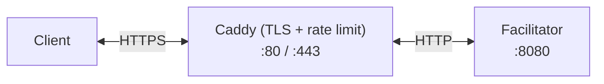

# x402 Facilitator — Deploy

x402 payment facilitator for on-chain verification and settlement. Handles EVM and Solana chains with automatic HTTPS, rate limiting, and zero-downtime updates.

## Architecture



- **Caddy** — Auto-HTTPS, rate limiting, security headers, request filtering
- **Facilitator** — x402 payment verification, settlement, signer key management
- **Watchtower** — Auto-pulls new images every 5 min, rolling restarts

## Prerequisites

- Linux server (Ubuntu 22.04+ / Debian 12+)
- Domain with DNS A record → server IP
- Ports **80** and **443** open

## Quick Start

```bash
git clone https://github.com/qntx/facilitator-deploy.git
cd facilitator-deploy

# 1. Configure — edit these two files:
cp config.example.toml config.toml
nano config.toml    # Add EVM / Solana signer private keys
nano Caddyfile      # Set your domain (replace facilitator.qntx.fun)

# 2. Deploy — one command does everything:
sudo bash setup.sh

# 3. Verify:
curl https://YOUR_DOMAIN/health
curl https://YOUR_DOMAIN/supported
```

The setup script is **idempotent** — safe to re-run after failures. It resumes from where it stopped.

```bash
sudo bash setup.sh --check    # Pre-flight checks only (no changes)
sudo bash setup.sh --force    # Redo all steps from scratch
```

## Daily Operations

After setup, use `fctl` (installed to PATH) or `make` shortcuts:

### Lifecycle

| Command | make | Description |
| --- | --- | --- |
| `fctl deploy` | `make deploy` | Pull latest images + recreate containers + health check |
| `fctl reload` | `make reload` | Smart reload — auto-detects which config changed |
| `fctl update` | `make update` | Pull latest Docker images + rolling restart |

### Observability

| Command | make | Description |
| --- | --- | --- |
| `fctl status` | `make status` | Dashboard: service status, health, image versions |
| `fctl doctor` | `make doctor` | Full diagnostics (ports, DNS, TLS, disk, health) |
| `fctl logs` | `make logs` | Follow facilitator logs |
| `fctl logs caddy` | `make logs-caddy` | Follow Caddy logs |
| `fctl logs watchtower` | `make logs-watchtower` | Follow Watchtower logs |
| `fctl logs all` | `make logs-all` | Follow all service logs |

### Configuration

| Command | make | Description |
| --- | --- | --- |
| `fctl edit config` | `make edit-config` | Auto-backup → edit → smart reload |
| `fctl edit caddy` | `make edit-caddy` | Auto-backup → edit → smart reload |
| `fctl backup` | `make backup` | Backup all config files (keeps last 10) |
| `fctl restore <ts>` | — | Restore config from backup timestamp |

### Maintenance

| Command | make | Description |
| --- | --- | --- |
| `fctl reset` | `make reset` | Stop all + remove volumes (destructive, requires confirmation) |
| `fctl purge` | `make purge` | Force-remove ALL x402-* containers/volumes/networks |
| — | `make prune` | Remove dangling Docker images |

## Common Workflows

### Config changed → reload

```bash
nano config.toml           # Make changes
fctl reload                # Auto-detects config.toml changed → restarts only facilitator
```

### Update Docker images manually

```bash
fctl update                # Pulls latest facilitator → rolling restart → health check
```

> Watchtower also auto-updates every 5 minutes. Manual update is only needed for immediate updates.

### Something broken → diagnose

```bash
fctl doctor                # Checks: Docker, disk, ports, containers, health, TLS
fctl logs                  # View facilitator logs
fctl logs all              # View all service logs
```

### Config broken → rollback

```bash
fctl backup                # List available backups
fctl restore 20260213-160000
fctl deploy                # Apply restored config
```

## Configuration Reference

### `config.toml` — Signer Keys & Chains

```toml
[signers]
evm = ["0xYOUR_EVM_PRIVATE_KEY_HERE"]       # hex, 0x-prefixed
solana = "YOUR_SOLANA_KEYPAIR_BASE58_HERE"   # base58, 64-byte keypair

[chains."eip155:8453"]
rpc = [{ http = "https://base-mainnet.g.alchemy.com/v2/$KEY" }]
```

> **RPC tip:** Do NOT use free public RPCs in production. Use [Alchemy](https://alchemy.com), [QuickNode](https://quicknode.com), [dRPC](https://drpc.org), or [Helius](https://helius.dev) (Solana).

### `Caddyfile` — Domain & TLS

Replace `facilitator.qntx.fun` with your domain. Everything else is pre-configured (auto-TLS, rate limiting, security headers).

## Security Notes

- Facilitator binds to `127.0.0.1:8080` — **not** exposed to the internet
- Only Caddy (80/443) is publicly accessible
- `config.toml` is `chmod 644` and gitignored
- Recommended firewall: `ufw allow 80,443/tcp && ufw deny 8080`

## Cloudflare (Optional)

If using Cloudflare proxy:

1. Set SSL/TLS mode to **Full (strict)**
2. Enable **Always Use HTTPS**
3. Restrict firewall to [Cloudflare IP ranges](https://www.cloudflare.com/ips/) only
